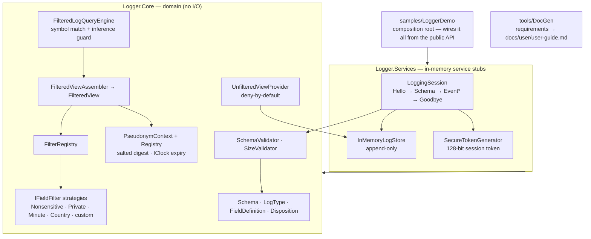

# cleancode

A personal practice repo for C# / .NET 10 (C# 14), built around **spec-driven development**
with Claude. The point is as much the *method* as the code: write a requirement, plan against
it, build, verify, and record what I learned.

## Start here
- **[CLAUDE.md](CLAUDE.md)** — the operating manual and index. Read this first.
- **See it run:** `dotnet run --project samples/LoggerDemo` — a narrated end-to-end demo (raw → filtered
  view, correlation queries, the inference guard, graduated access, session lifecycle).
- **Run the tests:** `dotnet test Logger.slnx` · **Regenerate the user guide:** `dotnet run --project tools/DocGen`

## The rules
1. **[docs/guardrails.md](docs/guardrails.md)** — hard do/don't (these win).
2. **[docs/code-policy.md](docs/code-policy.md)** — coding standards & conventions.
3. **[docs/workflow.md](docs/workflow.md)** — the Specify → Plan → Build → Verify → Reflect loop.

## What's inside
A privacy-aware **Logger** — schema-validated events, a pluggable filtering engine that turns raw
values into stable pseudonyms (`SAM → USER1(3)`, `66.77.88.99 → US1(v4)`), a symbol-based query with an
inference-attack guard, deny-by-default unfiltered access, and an in-memory session/store. Built
requirement-by-requirement from Loren Kohnfelder's *Designing Secure Software* "Logger" example.
**26 requirements · 4 code projects (+ 3 test projects) · 115 tests · a generated user guide.**

## Architecture
Layers depend **downward** (each arrow = "depends on"); `tools/DocGen` is a standalone tool that reads
the requirements. Automatic top-to-bottom layout.

## Where things live
- **[requirements/](requirements/)** — one spec per feature (the source of truth); start from
  [TEMPLATE.md](requirements/TEMPLATE.md), index in [requirements/README.md](requirements/README.md).
- **[src/Logger.Core/](src/Logger.Core/)** — the domain (schema, filtering engine, query, views).
- **[src/Logger.Services/](src/Logger.Services/)** — in-memory service stubs (session, store, tokens).
- **[tools/DocGen/](tools/DocGen/)** — generates [docs/user/user-guide.md](docs/user/user-guide.md) from the requirements.
- **[samples/LoggerDemo/](samples/LoggerDemo/)** — the runnable end-to-end demo.
- **[tests/](tests/)** — xUnit tests (one project per source project), 115 in total.
- **[docs/learning-log.md](docs/learning-log.md)** — what I practiced and why, per requirement.
- **[.editorconfig](.editorconfig)** — enforces the `this.` convention and formatting (in the build).

## Environment
- .NET 10 (`10.0.301`) default; .NET 9 available as fallback. Windows 11 / PowerShell.

## The loop, in one line
> Write a requirement → Claude plans → we build to policy → verify every acceptance criterion → log the lesson.
